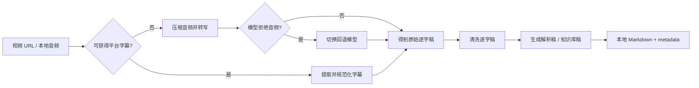

# 幕库 Muku：1800+ 视频站，一条链接变知识库

[English](https://github.com/qianzhu18/Muku/blob/main/README_EN.md) | 简体中文

> **1800+ 视频站解析入口。** 一条链接，收进你的 Markdown 知识库。

[](https://pypi.org/project/muku/)
[](https://pypi.org/project/muku/)
[](https://github.com/qianzhu18/Muku/actions/workflows/ci.yml)
[](https://github.com/qianzhu18/Muku/blob/main/LICENSE)
[](https://github.com/yt-dlp/yt-dlp/blob/master/supportedsites.md)

幕库接入了 [yt-dlp 的 1800+ 站点解析能力](https://github.com/yt-dlp/yt-dlp/blob/master/supportedsites.md)，主打 Bilibili、YouTube、Douyin，也能接收其他 yt-dlp 可解析站点的完整视频链接。只要能取得字幕或音频，后面的转写、清洗、解析和知识库整理就可以继续跑下去。

它不是“把视频下载下来就结束”的通用下载器，而是一条从视频链接到知识资产的完整链路：优先提取平台字幕，必要时回退音频转写，然后生成逐字稿、解析稿、知识库稿和可追踪的元数据。

| 1800+ | 1 条链接 → 4 类知识资产 | 4 种使用入口 |
| --- | --- | --- |
| 接入 yt-dlp 解析器生态 | 逐字稿、清洗稿、解析稿、知识库稿 | CLI、Web UI、Docker、AI-agent Skill |

> [!IMPORTANT]
> `1800+` 指 yt-dlp 当前提供的解析器范围，不代表 Muku 已逐站、逐链接人工验证。站点改版、登录态、地区、网络与 DRM 都可能影响结果；最可靠的判断方式仍然是用自己的真实链接跑一次。

## 为什么用幕库

- **1800+ 视频站入口**：不只写死三个平台；完整 URL 会先进入 yt-dlp 解析链路
- **Video-to-Markdown**：最终产物是适合 Obsidian、Git、全文检索、RAG 和 agent 工作流的 Markdown
- **字幕优先，转写兜底**：能拿平台字幕时避免重复转写；模型拒绝音频时自动回退，不制造假成功
- **本地优先**：文件、配置和知识资产保存在自己的电脑或自托管环境
- **批量与断点续跑**：支持 URL 文件、标准输入、并发、checkpoint、`--resume` 和 NDJSON 进度
- **面向自动化**：CLI 支持稳定 JSON 和纯路径输出，Skill 不需要驱动网页表单
- **可以继续长出来**：字幕、转写、清洗、解析和知识库生成被拆成独立环节，方便继续接平台、模型与输出模板
- **跨平台交付**：PyPI wheel 在 Ubuntu、macOS、Windows 上持续验证

## 60 秒开始

### 准备条件

- Python `3.10+`
- [ffmpeg](https://ffmpeg.org/)：用于音视频处理
- 一把 [OpenRouter](https://openrouter.ai/) API Key：用于音频转写和 AI 整理

安装 ffmpeg：

```bash
# macOS
brew install ffmpeg

# Ubuntu / Debian
sudo apt install ffmpeg
```

Windows 用户可以先看 [Windows 安装指南](https://github.com/qianzhu18/Muku/blob/main/docs/windows.md)。

### 安装 CLI

macOS / Linux 用户可以直接用一条命令安装 CLI 和 AI-agent Skill：

```bash
curl -fsSL https://raw.githubusercontent.com/qianzhu18/Muku/main/scripts/install-muku | bash
muku quickstart
```

Windows PowerShell：

```powershell
irm https://raw.githubusercontent.com/qianzhu18/Muku/main/scripts/install-muku.ps1 | iex
muku quickstart
```

安装器不会替用户创建 API Key，也不会自动读取或上传 Cookies。`muku quickstart` 会安全地提示输入
自己的 OpenRouter Key，配置默认目录并启动本地 Web UI；如果缺少 ffmpeg，会显示对应系统的安装命令。

如果只想安装 CLI，也可以使用隔离式 Python 工具安装，不依赖仓库，也不需要 npm：

```bash
# 二选一
uv tool install muku
pipx install muku

muku --version
muku setup
muku doctor --json
```

如果电脑上只有 Python 和 pip：

```bash
python3 -m venv .muku-venv
source .muku-venv/bin/activate
python -m pip install --upgrade pip muku
muku setup
```

`muku setup` 只需输入一把 OpenRouter Key，会同时配置转写、清洗、解析和知识库阶段；完整 Key 不会回显到终端。

### 生成第一份 Markdown

```bash
# 视频 URL -> 逐字稿 + 解析稿 + 知识库稿
muku capture "https://www.bilibili.com/video/BVxxxx" --knowledge --json

# 本地音频 -> 逐字稿 + 解析稿 + 知识库稿
muku audio "/path/to/audio.mp3" --knowledge --json
```

常见产物：

| 文件 | 内容 |
| --- | --- |
| `标题 - 原始逐字稿.txt` | 未经改写的转录文本 |
| `标题 - 逐字稿.md` | 清洗后的可读逐字稿 |
| `标题 - 解析稿.md` | 按提示词整理的结构化文章 |
| `标题 - 知识库.md` | 适合继续入库和检索的知识稿 |
| `标题 - 转写信息.json` | 来源、模型、处理路径和错误信息 |

## Web UI 与 Docker

想使用图形界面时，克隆仓库后启动 Docker Compose：

```bash
git clone https://github.com/qianzhu18/Muku.git
cd Muku
cp .env.example .env
docker compose up -d --build
```

Windows PowerShell：

```powershell
git clone https://github.com/qianzhu18/Muku.git
Set-Location Muku
Copy-Item .env.example .env
docker compose up -d --build
```

访问 `http://localhost:5657`，在右上角设置中填写 Key 和下载目录。先在宿主机浏览器登录 YouTube、Bilibili、Douyin，再运行
`./scripts/refresh-cookies all`；回到设置页点击“检查 Cookies”即可。纯本地 Python 运行时可以直接点击“一键配置本机浏览器 Cookies”。下载产物默认保存在 `./docker-data/downloads`，配置保存在 `./docker-data/config`。

本地运行的 Web UI 会自动把浏览器登录态按平台过滤并写入 `cookies/`；Docker 不会越权读取宿主机浏览器数据库，只会检查挂载到 `/cookies` 的文件。

更完整的容器说明见 [Docker 部署指南](https://github.com/qianzhu18/Muku/blob/main/docs/docker-deployment.md)。Web 面板适合个人、本地或可信网络，不建议直接暴露为公网多人服务。

## 工作原理



## 1800+ 站点支持范围

| 支持级别 | 平台 / 输入 | 推荐认证 | 说明 |
| --- | --- | --- | --- |
| ✅ 主链路适配 | Bilibili 视频页、分享链接 | `BILIBILI_COOKIES_PATH` | 字幕与高知识密度内容是主要场景 |
| ✅ 主链路适配 | YouTube 视频页、分享链接 | `YOUTUBE_COOKIES_PATH` | 字幕优先；部分视频需要登录态 |
| ✅ 主链路适配 | Douyin 分享链接、分享文案 | `DOUYIN_COOKIES_PATH` | 适合短视频观点和素材沉淀 |
| 🧩 基础兼容 | yt-dlp 1800+ 解析器生态中的其他站点完整 URL | `COOKIES_PATH` | 能否处理取决于 yt-dlp、目标站点与当前环境；请用真实链接验证 |
| 🎧 本地输入 | MP3、M4A、WAV 等 | 不需要平台 Cookies | 直接进入音频转写链路 |

这 1800+ 个解析器不是 1800+ 份硬编码适配。Muku 复用 yt-dlp 持续维护的站点生态，再把拿到的字幕或音频接进自己的知识处理链路。

- 免费公开内容通常最容易处理
- 登录后内容可能需要平台 Cookies
- VIP、DRM、加密 App 内视频和站点风控不在绕过范围内
- 平台策略会变化；请先运行 `muku doctor --json`，再用一条真实链接验证登录态和网络环境

## 批量任务

```bash
muku capture \
  --input-file ./urls.txt \
  --knowledge \
  --jobs 0 \
  --resume \
  --result-file ./runs/capture.json \
  --output paths
```

- `--jobs 0`：自动选择并发数
- `--resume`：复用 checkpoint 和已有产物
- `--result-file`：每个任务结束后增量写入结果
- `--stream`：输出 NDJSON 进度，适合 `tail -f`、监控和 agent 消费

完整命令见 [CLI 文档](https://github.com/qianzhu18/Muku/blob/main/docs/cli.md)。

## 安装 AI Skill

Skill 负责告诉 agent 何时以及如何调用 Muku CLI；上面的一键安装器会同时安装两者。
如果只安装了 Python 包，也可以单独安装 Skill：

```bash
git clone https://github.com/qianzhu18/Muku.git
cd Muku
./scripts/install-muku-skill
```

安装后可直接向支持 Skill 的 agent 提出：

> 使用 muku-video-to-md，把这个 B 站视频整理成逐字稿、解析稿和知识库 Markdown，并返回产物路径。

公开 Skill 位于 [skills/muku-video-to-md](https://github.com/qianzhu18/Muku/blob/main/skills/muku-video-to-md/SKILL.md)，更多说明见 [Skill 文档](https://github.com/qianzhu18/Muku/blob/main/skills/README.md)。

## 配置与安全

- 不要提交 `.env`、API Key、Cookies 或生成的私密内容
- Docker 优先使用平台专用 `cookies.txt`；本地调试也可以使用 `*_COOKIES_FROM_BROWSER`
- 默认转写模型为 `google/gemini-2.5-flash`，拒绝音频输入时会尝试回退模型
- `muku doctor --json` 会区分“已配置”和“已验证”，配置存在不等于目标平台一定可用
- 发现安全问题请按 [SECURITY.md](https://github.com/qianzhu18/Muku/blob/main/SECURITY.md) 私下报告，不要先公开 Issue

## 验证范围

| 环境 | 验证方式 |
| --- | --- |
| Ubuntu + Python 3.10 / 3.12 | 单元测试、CLI、自检、wheel 安装 |
| macOS + Python 3.12 | 单元测试、CLI、自检、wheel 安装 |
| Windows + Python 3.12 | 单元测试、CLI、自检、wheel 安装 |
| Docker Compose | 配置解析与本地部署 |
| PyPI | Trusted Publishing、独立安装烟测 |

“CI 通过”不代表所有平台链接永远可下载。视频站点的风控、Cookies、地区和网络状态仍会影响真实任务。

## 仍在快速迭代

Muku 现在是一个能跑起来的 `v0.x`，不是已经封死的最终形态。当前先把“视频输入 → 字幕 / 转写 → Markdown 知识资产”这条主链路做顺，后续仍可以继续扩展：

- 更多平台的专用解析与登录态体验
- 更多模型、提示词和 Markdown 输出模板
- 更顺手的批量采集、创作者主页与系列处理
- 更轻量的桌面端、浏览器与 agent 入口

想要的能力可以直接提交 [Issue](https://github.com/qianzhu18/Muku/issues)，也可以查看现有的 [输入扩展路线](https://github.com/qianzhu18/Muku/blob/main/docs/input-expansion-roadmap.md)。框架可以继续长，但判断是否支持某条视频，永远以真实链接跑通为准。

## 开发

```bash
git clone https://github.com/qianzhu18/Muku.git
cd Muku
python3 -m venv .venv
source .venv/bin/activate
python -m pip install -r requirements.txt -e . pytest
python -m pytest -q
```

提交改动前请阅读 [CONTRIBUTING.md](https://github.com/qianzhu18/Muku/blob/main/CONTRIBUTING.md) 和 [CODE_OF_CONDUCT.md](https://github.com/qianzhu18/Muku/blob/main/CODE_OF_CONDUCT.md)。Bug、功能建议和文档改进都欢迎提交 Issue 或 Pull Request。

## 文档

- [CLI 与自动化](https://github.com/qianzhu18/Muku/blob/main/docs/cli.md)
- [Docker 部署](https://github.com/qianzhu18/Muku/blob/main/docs/docker-deployment.md)
- [Windows 指南](https://github.com/qianzhu18/Muku/blob/main/docs/windows.md)
- [批量采集工作流](https://github.com/qianzhu18/Muku/blob/main/docs/creator-batch-workflow.md)
- [平台集成评估](https://github.com/qianzhu18/Muku/blob/main/docs/platform-integration-evaluation.md)
- [Skill 使用说明](https://github.com/qianzhu18/Muku/blob/main/skills/README.md)
- [安全策略](https://github.com/qianzhu18/Muku/blob/main/SECURITY.md)
- [贡献指南](https://github.com/qianzhu18/Muku/blob/main/CONTRIBUTING.md)

## 项目边界

- 当前定位是个人、本地、自托管和可信小团队工作流
- 普通网页应先由网页采集工具提取为 Markdown，不要直接塞进视频 `capture` 命令
- 项目不会绕过平台访问控制；请遵守目标站点条款、版权规则和所在地法律
- 转写与整理会产生第三方 API 成本，使用前请查看所选模型价格和 Key 限额

## License

[MIT](https://github.com/qianzhu18/Muku/blob/main/LICENSE) © 2026 qianzhu18
